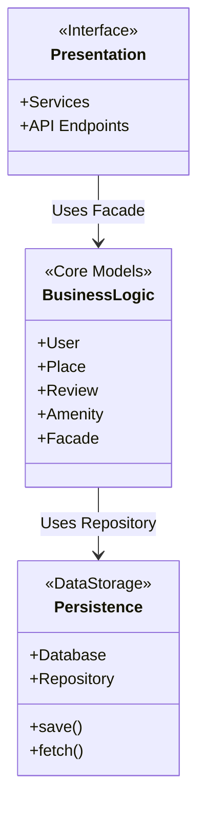
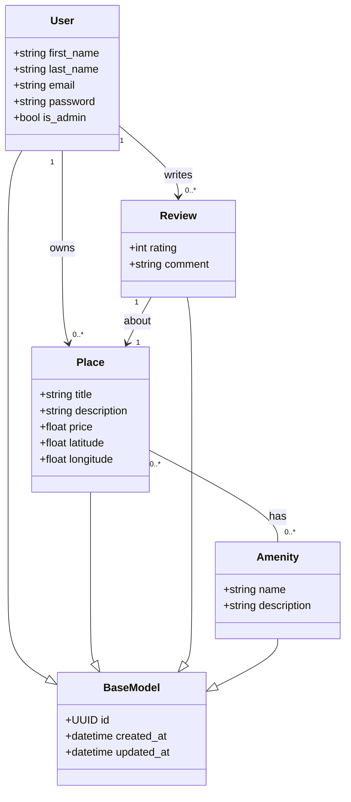
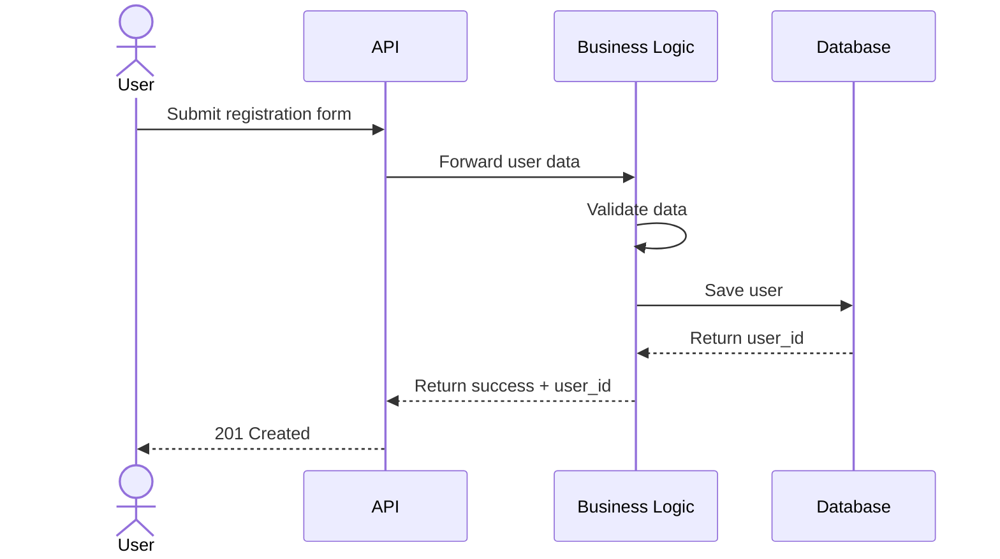
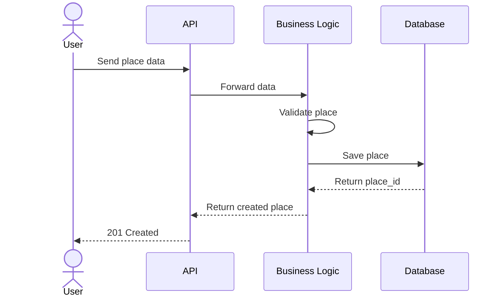
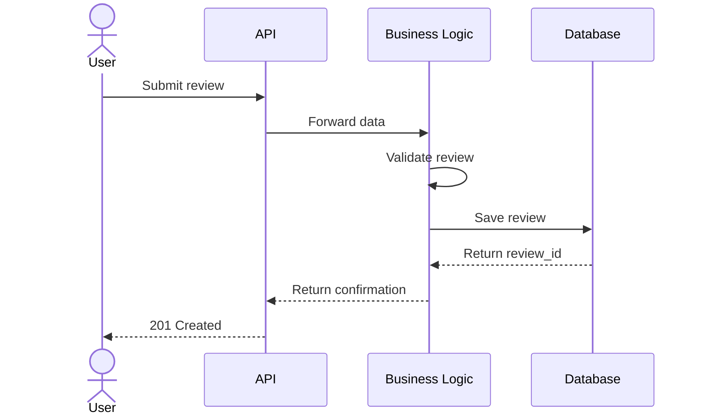
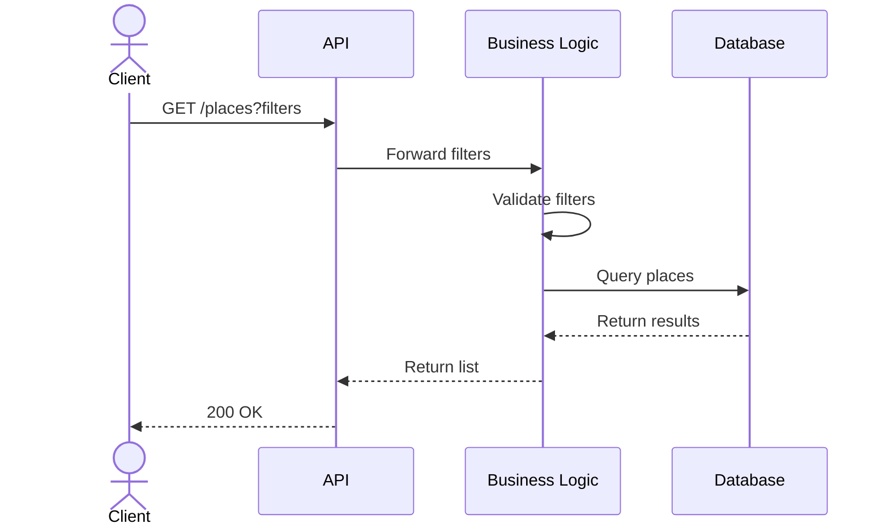

New README

# 🏠 HBnB Evolution — System Architecture Documentation

## 📌 Project Description

**HBnB Evolution** is a backend application inspired by Airbnb.
It allows users to:

* Register and manage accounts
* Create and manage places
* Write reviews
* Search for places using filters

This document explains the system architecture using **UML diagrams**, focusing on:

* Application structure
* Layer communication
* Data flow across the system

The system follows a **3-layer architecture** to ensure clean design, maintainability, and scalability.

---

# 🧱 1. High-Level Architecture

The application is divided into three main layers:

1. **Presentation Layer (API / Services)**
2. **Business Logic Layer (Core Models + Facade)**
3. **Persistence Layer (Database + Repository)**

---

## 📊 High-Level Package Diagram



---

# 🖥️ 2. Layer Responsibilities

---

## 🎯 Presentation Layer (API / Services)

This is the **user-facing layer**.

It:

* Receives HTTP requests (POST, GET, PUT, DELETE)
* Sends responses (JSON + status codes)
* Forwards data to the Business Logic layer

Think of it like a **hotel front desk**:
It receives requests and sends them to the correct department.

⚠️ Important:
The Presentation layer does **not** access the database directly.

---

## 🧠 Business Logic Layer (Core)

This is the **brain of the application**.

It:

* Contains core models (`User`, `Place`, `Review`, `Amenity`)
* Applies validation rules
* Enforces business rules
* Uses a **Facade** as a single entry point

### What is the Facade?

The API does not communicate with many classes directly.
Instead, it talks to **one main service (Facade)**.

The Facade:

* Receives requests from the API
* Coordinates internal logic
* Calls the correct models or repositories

This simplifies communication and keeps the system organized.

---

## 💾 Persistence Layer (Database)

This layer:

* Saves data
* Retrieves data
* Communicates directly with the database

The Business Logic layer uses a **Repository pattern** to access data.

This ensures:

* Separation of concerns
* Easier database replacement
* Cleaner architecture

---

# 📂 3. Example Project Structure

```text
hbnb/
│
├── api/              # Presentation layer
├── services/         # Business Logic (Facade)
├── models/           # Core Models
├── repository/       # Data access logic
├── database/         # Database configuration
└── main.py
```

---

# 🧩 4. Business Logic — Class Diagram

All models inherit from a shared parent class called `BaseModel`.



---

# 🔄 5. API Interaction Flows

---

## 🧾 Flow 1: User Registration

Endpoint: `POST /users/register`



### Step-by-Step

1. User sends registration data.
2. API forwards data to Business Logic.
3. Business Logic validates:

   * Required fields
   * Email format
   * Password rules
   * Email uniqueness
4. If valid, data is saved through Repository.
5. Database confirms save.
6. API returns `201 Created`.

---

## 🏡 Flow 2: Creating a Place

Endpoint: `POST /places`



### Validation Includes:

* Title not empty
* Valid price
* Latitude/Longitude range
* User exists

---

## ⭐ Flow 3: Submitting a Review

Endpoint: `POST /reviews`



### Validation Includes:

* Rating between 1–5
* Comment not empty
* User exists
* Place exists
* Optional: Prevent duplicate review

---

## 🔎 Flow 4: Fetching Places

Endpoint: `GET /places?filters`



### Business Logic Responsibilities:

* Validate filter types
* Build query
* Handle pagination
* Return results + metadata

---

# 🔐 6. Architectural Principles Used

* ✅ 3-Layer Architecture
* ✅ Separation of Concerns
* ✅ Facade Pattern
* ✅ Repository Pattern
* ✅ Object-Oriented Design
* ✅ UML Modeling

---

# ✅ Conclusion

The HBnB Evolution architecture ensures:

* Clear separation between layers
* Maintainable and scalable design
* Clean model relationships
* Controlled data access
* Well-defined API flows

The UML diagrams provide a structured overview of how the system components interact and how data moves through the application.

---

## ✍️ Author

Holberton School — HBnB Project   
Team: 👥 - [David Roset](https://github.com/DevEchoFR) - [Tom Marchal](https://github.com/TomMrcl)
